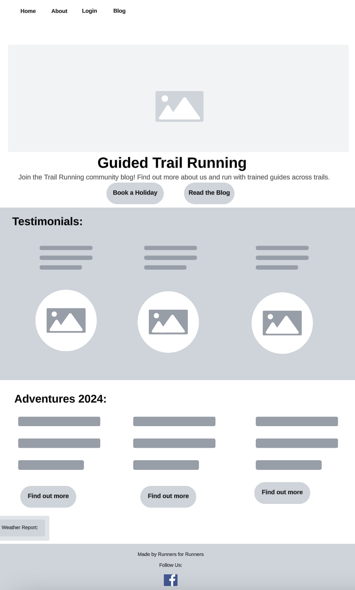
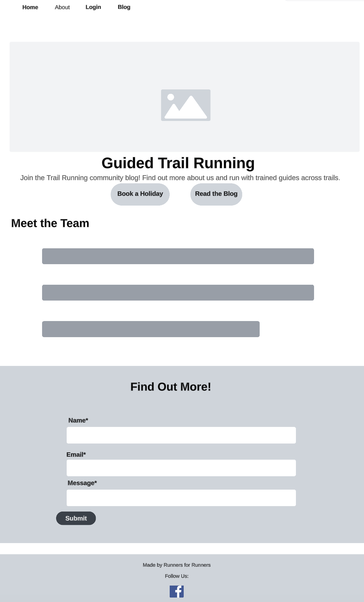
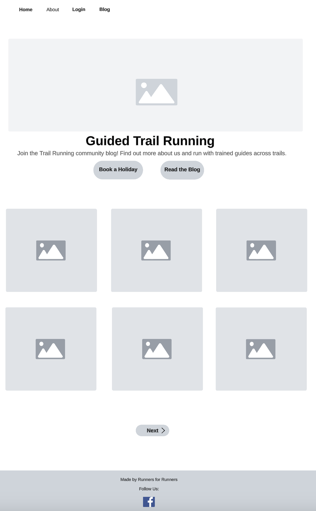

# Guided Trail Running


Take a look at the deployed site here: [Guided Trail Running](https://trailrunning-f565347cbca0.herokuapp.com).


# Project Summary

Guided Trail Running is a blog for like minded trail runners to come together and discuss trail running. The blog also acts as a marketing tool to allow the site owner to encourage runners to sign up to their guided running holidays. The site is designed to grow into an informative resource for trail runners.

# Project Aim & UX Goals

## Project Goals
The website is aimed at bringing together trail runners and facilitating community engagement. The aim is to provide an informative experience for trail runners and the option to meet up together via trail running holidays.
Users can also feel part of the online community in the blog area where they can sign up and read and comment on blog stories. They can also find out more from the site owner about trail running holidays organised by the site owner via an about page and a 'find out more' contact form.

## User Experience
I kept the navigation simple and intuitive as this was my first project using Django. I created an easy registration process and kept a welcoming design that feels aligned with the outdoors.

## Target Audience
The target audience are both people new to trail running and those with trail running experience. The audience for trail running holidays is usually mixed, however, more women tend to sign up to holidays and the site reflects this, with images of groups of people and women represented in the images presented.

# Planning
I used Lucid to create wireframes. I then created a Repository in GitHub and set up GitHub Issues and created a Kanban Board following an Agile methodology. The steps are below:

## Creating a Repo in GitHub
At the start of the project, I created a repository in GitHub. These are the steps I followed:

### Create a GitHub Repository
Go to GitHub and log into your account.
In the top-right corner, click the + icon, then select New repository.
Name your repository and add an optional description.
Choose the repository's visibility, for this assessed project I chose 'public'.
Initialize the repository with a README and .gitignore.
Click 'Create repository'.

### Open the IDE
I used Gitpod for this project and loaded the project in Gitpod via the link found by clicking the green 'code' button, located at the top right of the repository.

## Setting up GitHub Issues
For this project I followed an Agile methodology. I created a set of issues based on the blog walkthrough provided by Code Institute as this was my first project working in this manangement style. Below are the steps I took to set up ten issues for the project:

- Go to your GitHub repository.
- Click on the Issues tab in the top menu.
- Click New Issue to create an issue.
- Title: Give each issue a clear title, like "Open a Post".
- Description: Add details about the issue, including the requirements or acceptance criteria, so it’s clear what needs to be done.
- Label the Issue:For Agile, I used labels "To do" "In Progress," and "Done."

## Create a Kanban Board in GitHub
I created a project in GitHib called 'Running project user stories' and linked my issues to the board. See this link to my board: [Kanban Board](https://github.com/users/Katherine-Holland/projects/2)

I also labelled them using MoSCow Prioritization to ensure I worked on the user stories in order of importance. These are the steps I followed to set this up:

- Go to the "Projects" tab of your repository.
- Click New Project to create a project board.
- Select “Table or Board” view, which will help structure your tasks into columns for better tracking. I had 'To do', 'In Progress' and 'Done'.
- Name Your Board (e.g., "Running project user stories") and add an optional description.

## Link Issues to the Kanban Board

Go back to the Issues tab and open an issue you’d like to add to the Kanban board.
In the right sidebar of the issue, find Projects and select your new Kanban board from the dropdown.
The issue will now appear in your board’s 'To do' list.

## Manage Workflow using an Agile Methodology

I prioritised the issues in the To Do list (using MoSCoW prioritization - see below).
I then moved Issues through the Kanban Board from 'To Do' - 'In Progress' - 'Done' - 'Closed'. I specifically focused on the blog as I was new to this way of working and used the Code Institute Blog walkthrough to assist me in understanding the workflow process.

## MoSCoW Prioritization
MoSCoW prioritization is a technique used to categorize project requirements into levels of importance. This prioritization helps focus development efforts on what will deliver the most value and keeps the project on track. 
- I used MoSCoW prioritization to rank how essential each feature would be. See image below for my user stories and how I labelled them. 
- I used the 'Must-Have' and 'Should-Have' in my project:

Must-Have: These are essential features without which the project would be incomplete or fail to meet its core purpose. For my project this included for example, the ability to create and view posts.

Should-Have: These features are important but not essential for a working release. They add significant value but won’t stop the project from functioning if left out. For instance, I added a weather integration feature and a welcome message which wasn't essential but enhanced the user experience.

Other labels I will use for future projects include:

'Could-Have': These are desirable features that would enhance user experience but are not critical.

'Won't-Have' (for now): These features are acknowledged but intentionally deferred for a later phase. This could include advanced search features or more complex social login options. A feature I would like to add in later iterations.

## User Stories
Here are the User Stories I focused on in order to learn how to work within the Agile methodology.

### 1. Open a post
As a site user I can click on a post so that I can read the full text.
AC1 When a blog post title is clicked on a detailed view of the post is seen.

### 2. View Comments 
As a Site User/Admin I can view comments on an individual post so that I can read the conversation.
AC1 Given one or more user comments the admin can view them.
AC2 Then a site user can click on the comment thread to read the conversation.

### 3. Account Registeration
As a Site User I can register an account so that I can comment on a post.
AC1 Given an email a user can register an account.
AC2 Then the user can log in.
AC3 When the user is logged in they can comment.

### 4. Comment on a post
As a Site User I can **leave comments on a post ** so that I can be involved in the conversation.
AC1 When a user comment is approved.
AC2 Then a user can reply.
AC3 Given more than one comment then there is a conversation thread.

### 5. Modify or Delete Comment on a post
As a Site User I can *modify or delete my comment on a post so that I can be involved in the conversation.
AC1 Given a logged in user, they can modify their comment.
AC2 Given a logged in user, they can delete their comment.

### 6. Manage Posts
As a Site Admin I can create, read, update and delete posts so that I can manage my blog content.

AC1 Given a logged in user, they can create a blog post.
AC2 Given a logged in user, they can read a blog post.
AC3 Given a logged in user, they can update a blog post.
AC4 Given a logged in user, they can delete a blog post.

### 7. Create Drafts
As a Site Admin I can create draft posts so that I can finish writing the content later.

AC1 Given a logged in user, they can save a draft blog post.
AC2 Then they can finish the content at a later time.

### 8. Approve Comments
As a Site Admin I can approve or disapprove comments so that I can filter out objectionable comments.

AC1 Given a logged in user, they can approve a comment.
AC2 Given a logged in user, they can disapprove a comment.

### 9. View a Paginated list
As a User I can view a paginated list of posts so that I can discover the post I want to read easily.

### 10. Create a Contact Us Form
As a Potential Customer, I can send the site owner a message so that I can find out more about the holidays and potentially book.

AC1 A user can submit a request for more information without logging in.
AC2 A user can see a confirmation message that the submission has been successful.

As a Site Owner, I can store booking messages in the database so I can review them and respond.

AC1 A Site Owner can see the booking messages in the admin area.
AC2 A Site Owner can mark messages as "read" to allow for processing unread messages and avoiding missing requests.


# Site Design

## Home Page
The Home page has a simple clean design with a main banner showing a trail running scene across the wilds of Dartmoor National Park in Devon, UK. 
The call to action buttons directs the user to the blog and the 'book a holiday' contact form, this is followed by testimonials for the running holidays on offer.

## Typography
Noto and Sans were used for their simplicity and easy to read style. For the welcome message Courier was chosen to match the informal typewriter effect of the animation.

## Color Palette
I chose a simple colour scheme of greys and greens to match the feel of the environment found in Trail Running. This simple design also helped the user to navigate easily around the site.

### Features
- I added in a welcome message to the top of the banner which changes greeting based upon the time of day, for example, 'good morning', 'good afternoon' or 'good evening'. This gives the user a more personalised experience whilst using the site.

- A weather report for the Lake District also features at the bottom of the page. The purpose of this is to inform users of the site as to the weather conditions in that area and if it is suitable (and safe) weather for a run. This was added near to the end of he project as I had time to take a look at API calls with Django. In future, I would have added this as a User Story.

### Navbar
The navbar includes links to the Home page, About Page, Register, Log In (or Log Out) and Blog. This simple layout makes the site simple to navigate. On mobile screens this also assists the user to find the correct page quickly under the menu bar icon.

### About and CRUD Functionality
The About page features information about the site owner who organises the trail running holidays. 

Below this is the contact form to find out more about booking a holiday. 

The form asks for the fields: Name, Email and Message. The user then clicks the 'Submit' button and a pop up states 'We have received your booking request! We will respond shortly.' This reassures the site user that the form has been successfully submitted.

The form also requires that all fields are filled out and requests that the user does so, if the field is left empty. The user also has to provide a valid email address, or the user is asked to 'please provide an '@' in the email address.'

### Register and CRUD Functionality
The Register page features a sign up form which requests a 'Username', 'email (which is an optional field)' a 'password' and a 'password again' field.

I have kept this form simple as it speeds up the sign up process and gets users engaging with the community quickly which should help to keep users on the site for longer. 

If a user makes an error a message is generated to ask them to for example, to create a username with the rules in place for doing so. Upon registering the user sees a 'Successfully signed in as... (their username)'. The top navigation then switches from "Log In' to 'Log Out'.

To help the user experience, there is also a link to the 'sign in', if the user already has an account.

### Login, Log Out and CRUD Functionality
The login page has two fields, 'username' and 'password' plus a tick box for 'Remember Me'. 
There is also a link to the register page in case the user does not have an account yet. 

If a user tries to sign in without a valid username then the user sees a message saying 'The username and/or password you specified are not correct.'

If the user wants to log out, they simply click Logout in the Nav bar. 
This action then generates a message to the user asking: 'Sign Out. Are you sure you want to sign out?', followed by the 'Sign Out' button. 
Upon clicking this sign out button the user then sees a message saying: 'You have signed out.'.

### Blog and CRUD Functionality
A signed out user can see all of the blog posts and comments but also sees a message which says: 'Log in to leave a comment'. 
The user cannot leave a comment until they register or sign in with an existing account.

A signed in user can see all of the blog posts and comments alongside a box with the title 'Leave a Comment" and a 'bosy' field which must be filled in to allow the user to click the 'Submit' button. 
If the body field is left blank and the user clicks 'submit' then a message appears asking the user to ' please fill in this field'. 
The comment option also features the username of the person submitting the comment.
Users can also like or unlike comments and the number of likes is displayed using a heart emoji to show other users any popular remarks. This was implemtented toward the end of the project as I became more confident with Django. In future, I would have added this as a User Story and run it through the Kanban Board.

After submission, the user sees a message saying 'Comment submitted and awaiting approval'. 
The user then has the option to press a 'delete' or an 'edit' button and their comment can be seen above this in a faded colour with the additional message 'This comment is awaiting approval'. 

If the user edits their comment and submits it again, they then receive a notification saying 'Comment Updated!'.

If the user clicks on 'delete' they see a pop up asking: 'Delete comment? Are you sure you want to delete your comment? This action cannot be undone.' and an option to 'Close' or 'Delete'. If deleted the user sees a message saying : 'Comment deleted!'.

## Technologies Used

- HMTL, CSS, JavaScript, Python and Django.

- [Lucid Wireframes](https://lucid.app/documents/#/home?folder_id=recent) 

- Heroku was used for deployment.

- GitHub was used for storing the Repository and READme. 

- Git was used for version control --> "git add . " --> "git commit -m "**message**" --> "git push".

- [Google Fonts was used to import fonts for the project.](https://fonts.google.com/) 

- [PostgreSQL supplied by the Code Institute](https://dbs.ci-dbs.net/).

- [The Code Institute database maker](https://dbs.ci-dbs.net/).

- [Cloudinary](https://cloudinary.com/).

- Django Aullauth was used for handling the forms and allowing users to register and sign in.

- [Django Crispy Forms](https://django-crispy-forms.readthedocs.io/en/latest/) 

- [Whitenoise](https://whitenoise.readthedocs.io/en/latest/index.html) (A pip package that allows you to configure your Django project to serve its own staticfiles so it can deploy anywhere without depending on service providers.)

- Bootstrap

- [OpenWeather API](https://home.openweathermap.org/)

# Website Planning

## Wireframes
These were the mock ups I used to build out my site. The site is responsive and as the screen size diminishes, the images disappear and the navbar becomes a small icon with a drop down menu.

## Home Page Wireframe

 


## About Page Wireframe




## Blog Wireframe




# Testing

## User Story Testing
All user stories worked as expected with the exception of the 'Edit Comment' function. Please see the 'Bugs' section for further information. All user stories were moved through the Kanban Board and were marked as closed.

## Browser Compatibility

The site works as intended on Google Chrome and Safari and across mobile devices. This was tested with the Google Developer Tools and was found to be responsive.


## Validations

- HTML Validation
I used [W3 html validator](https://validator.w3.org/nu/#textarea) to check my html files.

| Directory  | File                    | Result |
|------------|-------------------------|--------|
| blog       | create_post.html        | PASS   |
| blog       | edit_post.html          | PASS   |
| blog       | post_detail.html        | PASS   |
| blog       | post_list.html          | PASS   |
| home       | home.html               | PASS   |
| signup     | login.html              | PASS   |
| signup     | logout.html             | PASS   |
| signup     | signup.html             | PASS   |


- JavaScript validation
I used [JSHint](https://jshint.com/) to validate my js files.

|   File       	| Result |
|-----------------|--------|
| comments.js     |  PASS  |


- CSS Validation
I used [W3 CSS Validator](https://jigsaw.w3.org/css-validator/#validate_by_input) to validate my CSS style sheet.

|   Directory   	|   File       	| Result |
|---------------	|--------------	|--------|
|   static/css  	|   style.css  	|  PASS  |


- Python Validations
I used the [Code Institute PEP8 Linter](https://pep8ci.herokuapp.com/) to validate my Python files.

| App    	| File    	    | Result|
|----------	|---------------|-------|
| blog     	| admin.py    	 | PASS  |
| blog     	| apps.py   	 | PASS  |
| blog     	| forms.py      | PASS  |
| blog     	| models.py     | PASS  |
| blog     	| test_forms.py | PASS  |
| blog      | test_views.py | PASS  |
| blog      | urls.py.      | PASS  |
| blog      | views.py      | PASS  |
| about     | admin.py      | PASS  |
| about     | apps.py       | PASS  |
| about     | forms.py      | PASS  |
| about     | models.py     | PASS  |
| about     | test_forms.py | PASS  |
| about     | urls.py       | PASS  |
| about     | views.py      | PASS  |
| home     	| apps.py     	 | PASS	|
| home     	| settings.py   | PASS 	|
| home     	| urls.py       | PASS  |
| home     	| utils.py      | PASS	|
| home     	| views.py      | PASS  |

## Lighthouse Testing (Desktop and Mobile)
Lighthouse testing was successful for all pages, meeting accessibility requirements.

| Page    |  Accessibility | Best Practices | SEO |
|---------|----------------|----------------|-----|
| Home    | 95%            |  96%           | 91% |
| About   | 95%            |  96%           | 91% |
| Log Out | 92%            |  96%           | 91% |
| Log In  | 93%            |  96%           | 91% |
| Blog    | 95%            |  96%           | 91% |
| Post    | 93%            |  96%           | 91% |
| Register| 94%            |  96%           | 91% |

## Manual Testing

### Navigation Link Testing

| Directory  | File                                                             | Steps                                    | Result |
|------------|------------------------------------------------------------------|------------------------------------------|--------|
| home       | https://trailrunning-f565347cbca0.herokuapp.com                  |Click on the Home Link in the Nav bar     | PASS   |
| about      | https://trailrunning-f565347cbca0.herokuapp.com/about            |Click on the About Link in the Nav bar    | PASS   |
| register   | https://trailrunning-f565347cbca0.herokuapp.com/accounts/signup  |Click on the Register Link in the Nav bar | PASS   |
| login      | https://trailrunning-f565347cbca0.herokuapp.com/accounts/login   |Click on the Login Link in the Nav bar    | PASS   |
| blog       | https://trailrunning-f565347cbca0.herokuapp.com/blog             |Click on the Blog Link in the Nav bar     | PASS   |
| Footer     | https://www.facebook.com/YourPageName                            |Click on the Facebook Link in the Footer  | PASS   |            

### Testing the user flow

Home Page:

| Test Name      | Steps                                | Expected Result                               | Actual Result     | Pass/Fail |
|----------------|-------------------------------------|------------------------------------------------|-------------------|-----------|
| Book a Holiday | Click on the 'Book a Holiday" button | User is redirected to the about page.         | Same as expected  | PASS      |
| Read the Blog  | Click on the 'Read the Blog" button  | User is redirected to the blog page.          | Same as expected  | PASS      |
| Find Out More  | Click on the 'Find Out More" button  | User is redirected to the about page.         | Same as expected  | PASS      |

About Page:

| Test Name      | Steps                                | Expected Result                                      | Actual Result     | Pass/Fail |
|----------------|--------------------------------------|------------------------------------------------------|-------------------|-----------|
| Book a Holiday | Click on the 'Book a Holiday" button | User is redirected to the about page.                | Same as expected  | PASS      |
| Read the Blog  | Click on the 'Read the Blog" button  | User is redirected to the blog page.                 | Same as expected  | PASS      |
| Submit         | Click on the 'Submit" button         | User successfully submits an enquiry.                | Same as expected  | PASS      |
| Admin database | Messages are stored in the database  | Admin can see and store messages within About section| Same as expected  | PASS      |
| Admin read     | Messages can be marked as read via   |                                                      |                   |           |
|                | ticking a 'read' checkbox.           | Message is marked with a green tick box in the inbox | Same as expected  | PASS      |

Register Page:

| Test Name      | Steps                                | Expected Result                               | Actual Result     | Pass/Fail |
|----------------|--------------------------------------|-----------------------------------------------|-------------------|-----------|
| Book a Holiday | Click on the 'Book a Holiday" button | User is redirected to the about page.         | Same as expected  | PASS      |
| Read the Blog  | Click on the 'Read the Blog" button  | User is redirected to the blog page.          | Same as expected  | PASS      |
| Sign Up        | Click on the 'Sign Up" button        | User successfully registers with the site     | Same as expected  | PASS      |
| Sign In        | Click to be redirected to 'Sign In'  | User is redirected to the Login page.         | Same as expected  | PASS      |

Login Page:

| Test Name      | Steps                                | Expected Result                               | Actual Result     | Pass/Fail |
|----------------|--------------------------------------|-----------------------------------------------|-------------------|-----------|
| Book a Holiday | Click on the 'Book a Holiday" button | User is redirected to the about page.         | Same as expected  | PASS      |
| Read the Blog  | Click on the 'Read the Blog" button  | User is redirected to the blog page.          | Same as expected  | PASS      |
| Sign In        | Click on the 'Sign In" button        | User successfully signs into the site         | Same as expected  | PASS      |
|                |                                      | and sees the Log Out tab in the nav bar.      |                   |           |

Blog Page:

| Test Name      | Steps                                | Expected Result                               | Actual Result     | Pass/Fail |
|----------------|--------------------------------------|-----------------------------------------------|-------------------|-----------|
| Book a Holiday | Click on the 'Book a Holiday" button | User is redirected to the about page.         | Same as expected  | PASS      |
| Read the Blog  | Click on the 'Read the Blog" button  | User is redirected to the blog page.          | Same as expected  | PASS      |
| Read a Blog    | Click on a blog post                 | User successfully opens a selected blog post  | Same as expected  | PASS      |

Logout Page:

| Test Name       | Steps                                | Expected Result                               | Actual Result     | Pass/Fail |
|-----------------|--------------------------------------|-----------------------------------------------|-------------------|-----------|
| Book a Holiday  | Click on the 'Book a Holiday" button | User is redirected to the about page.         | Same as expected  | PASS      |
| Read the Blog   | Click on the 'Read the Blog" button  | User is redirected to the blog page.          | Same as expected  | PASS      |
| Sign Out Button | Click on the 'Sign Out' button       | User is redirected to the home page and sees  | Same as expected  | PASS      |
|                 |                                      | a pop up 'You have signed out'. The nav bar   |                   |           |
|                 |                                      | then shows the Log In tab.                    |                   |           |                                                       

### Testing the CRUD and fields

About Page:

| Test Name      | Steps                                | Expected Result                                              | Actual Result     | Pass/Fail |
|----------------|--------------------------------------|--------------------------------------------------------------|-------------------|-----------|
| Find out More  | Fill out the 'name' field            | User adds name to field. If missing the user sees a warning  |                   |           |
|                |                                      | 'Please fill in this field'                                  | Same as expected  | PASS      |
| Find Out More  | Fill out the 'email' field           | User adds email to field. If missing the user sees a warning |                   |           |
|                |                                      | 'Please include an @ in the email address'                   | Same as expected  | PASS      |
| Find Out More  | Fill out the 'message' field         | User adds name to field. If missing the user sees a warning  |                   |           |
|                |                                      | 'Please fill in this field'                                  | Same as expected  | PASS      |
| Submit Button  | Click the 'Submit' button            | User sees a pop up: 'We have received your booking request!  |                   |           |
|                |                                      | We will respond shortly.'                                    | Same as expected  | PASS      |


Register Page:

| Test Name      | Steps                                | Expected Result                                                          | Actual Result     | Pass/Fail |
|----------------|--------------------------------------|--------------------------------------------------------------------------|-------------------|-----------|
| Username       | Fill out the 'username' field        | User adds name to field. If missing the user sees a warning              |                   |           |
|                |                                      | 'Please fill in this field'                                              | Same as expected  | PASS      |
| Email          | Fill out the 'email' field           | User adds email to field. If missing the user sees a warning             |                   |           |
|                |                                      | 'Please include an @ in the email address'                               | Same as expected  | PASS      |
| Password       | Fill out the 'password' field        | User adds name to field. If missing the user sees a warning              |                   |           |
|                |                                      | 'Please fill in this field'                                              | Same as expected  | PASS      |
|                |                                      | If a user adds an email already in use an error is displayed:            |                   |           |
|                |                                      | 'A user is already registered with this email address.'                  | Same as expected  | PASS      |
| Password again | Confirm 'password' in field          | User repeats password. If there is something incorrect the user          |                   |           |
|                |                                      | sees a generated warning:                                                |                   |           |
|                |                                      | If the username matches the password:                                    |                   |           |
|                |                                      | - Your password can’t be too similar to your other personal information. | Same as expected  | PASS      |
|                |                                      | If the password is shorter than 8 characters:                            |                   |           |
|                |                                      | - Your password must contain at least 8 characters.                      | Same as expected  | PASS      |
|                |                                      | If the password is too common:                                           |                   |           |
|                |                                      | - Your password can’t be a commonly used password.                       | Same as expected  | PASS      |
|                |                                      | If the password is only numeric:                                         |                   |           |
|                |                                      | - Your password can’t be entirely numeric.                               | Same as expected  | PASS      |
|                |                                      | If the password 'again' field doesn't match the password chosen:         |                   |           |
|                |                                      | - You must type the same password each time.                             | Same as expected  | PASS      |
| Sign Up        | User clicks "Sign Up' button         | User sees pop up 'Successfully signed in as 'username'' and Log out is   |                   |           |
|                |                                      | now visible as replacement of Log In on the navigaton bar.               | Same as expected  | PASS      |


Log In Page:

| Test Name      | Steps                                 | Expected Result                                                          | Actual Result     | Pass/Fail |
|----------------|---------------------------------------|--------------------------------------------------------------------------|-------------------|-----------|
| Username       | User inputs their registered username | Username field should be populated.                                      | Same as expected  | PASS      |
| Password       | User inputs their password            | If password correct user sees: 'Successfully signed in as 'user' and nav |                   |           |
| Password       | User inputs their password            | bar shows log out tab.                                                   | Same as expected  | PASS      |
| Remember Me    | User checks box                       | If checked, user remembered for next sign in.                            | Same as expected  | PASS      |

Blog Page:

| Test Name      | Steps                                 | Expected Result                                                          | Actual Result     | Pass/Fail |
|----------------|---------------------------------------|--------------------------------------------------------------------------|-------------------|-----------|
| Click on post  | User selects blog to read             | User is directed to blog post                                            | Same as expected  | PASS      |
| Comment        | User can leave a comment              | User writes comment and clicks submit. The user sees a pop up 'Comment   |                   |           |
|                |                                       | submitted and awaiting approval'.                                        | Same as expected  | PASS      |
| Admin comment  | Admin can click on comments to view   | Admin can see all comments added.                                        | Same as expected  | PASS      |
| Admin approve  | Admin can click 'approved' checkbox   | Comment is published successfully from comments section.                 | Same as expected  | PASS      |
| Edit Comment   | User can click on edit button         | User clicks update button and sees the message 'Comment Updated!'        | Same as expected  | PASS      |
| Delete Comment | User can click on delete button       | User clicks delete and sees the message Are you sure you want to delete  |                   |           |
|                |                                       | your comment? This action cannot be undone.' User clicks close or delete.| Same as expected  | PASS      |
|                |                                       | If user confirms delete they see 'Comment deleted!'                      | Same as expected  | PASS      |
|                |                                       | If user clicks close, the message stays as awaiting approval.            | Same as expected  | PASS      |
| Like a post    | User can click on the heart emoji     | If the user clicks the heart emoji it shows as liked. If clicked again   |                   |           |
|                |                                       | the like is removed.                                                     | Same as expected  | PASS      |
| Create post    |                                       |                                                                          |                   |           |
| and management | Site Admin can create, read, update & | Admin can create a post by clicking 'Add post", read current posts, edit |                   |           |
|                | and delete posts under Blog - Posts   |posts by clicking on the post link, save post by clicking 'save' and      |                   |           |
|                |                                       |delete post by clicking 'delete'.                                         | Same as expected  | PASS      |
| Draft Post     | Site Admin can draft a post after     |                                                                          |                   |           |           
|                | clicking 'Add Post' then 'Save &      |Post saves and is accessible for further editing.                         |                   |           |
|                | continue editing'                     |                                                                          | Same as expected  | PASS      |           | Admin Comments | Under comments Admin can approve or   | Comment is approved and saved to show on website or is not approved and  |                   |           |
|                | disapprove via checkbox tick.         | remains hidden.                                                          | Same as expected  | PASS      |     

## Bugs
1. Using the Google Dev Tools I picked up a 'null' error for GetElementbyId when the user was editing a post. I realised that get GetAttribute was not complete, after amending the code, the Developer Tools picked up no further errors.

# Credits

- My Mentor Spencer.
- Code Institute support staff.
- Code Institute P4 walkthrough projects. 
- Literature: Django by Example by Antonio Mele.

As I worked through the walkthroughs and followed the steps I became more confident. It took a while for the processes and methodology I was working with to 'click' but toward the end of the project, and with the help of staff and my Mentor, the process became more obvious and I now feel I can expand on my user stories and create more complex Django projects moving forward. 

# Future features 

- Log In
Adding the option for a social sign in to improve user experience.
- Booking Page
Add a booking feature to allow users to book holidays.
- Blog Page
Add the option of commenting to another comment and notifying the commenter of the response.
- Home Page
Add a more comprehensive weather outlook for each area with weather symbols.
- Home Page
Modifying the welcome message to only show on the home page and limiting the message to once per user session.

### For Developers

#### Forking the Repository
1. Go to the GitHub repository: [Open in GitHub](https://github.com/Katherine-Holland/running).
2. Click the **Fork** button in the upper right corner of the page to create a copy of the repository under your own GitHub account.
3. After forking, you can open it in Gitpod using the button above.

#### Cloning the Repository
If you are working locally, you can clone the repository:
1. Open your terminal or command prompt.
2. Run the following command to clone the repository:
   ```bash
   git clone https://github.com/Katherine-Holland/running.git
3. Navigate to the directory:
   ```bash
    cd running
    
4. You can then set up your environment and run the project locally.

#### Clone the Repository - Alternative Method

1. Click on the green Code button at the top right of the repository and copy the URL that appears.
    In your terminal, use the following command to clone the repository:
    ```bash
    git clone https://github.com/Katherine-Holland/running.git

2. Replace <URL> with the URL you copied from GitHub, 
    which should look like https://github.com/Katherine-Holland/running.git.

3. Navigate to the Project Directory.
    After cloning, navigate into the project directory by running:
    ```bash
    cd repository-name

2. Install Project Dependencies
Install project dependencies by checking the requirements.txt file.

3. Running the Project
Follow the instructions in the repository for running the project locally using Django. This project uses: python manage.py runserver.

### Set up with Heroku
1. Create a Heroku account.
2. Create a new app, give the app a unique name and select your region from the options.
3. Connect to GitHub (or login if prompted).
4. Select which branch you want to deploy from.

### Deploy with Heroku
Here's how to deploy your Django project from Gitpod to Heroku. After setting up a Heroku account, install the Heroku CLI in Gitpod. Here are the steps:

1. Install Gunicorn
   In your Gitpod terminal, install Gunicorn (a WSGI server for serving your app) and Django-Heroku (for configuring Heroku settings automatically):
    ```bash
    pip install gunicorn django-heroku

2. Update requirements.txt
   Make sure to add these new dependencies to your requirements.txt file. Update it with:
   ```bash
    pip freeze > requirements.txt

3. Configure settings.py for Heroku
   Import django_heroku at the top of your settings file:
    ```python
    import django_heroku

4. At the bottom of your settings.py file, add:
    ```python
    django_heroku.settings(locals())

4. Create a Procfile
   In the root directory of your project, create a file named Procfile (no file extension) to tell Heroku how to run your application:
    ```plaintext
    web: gunicorn your_project_name.wsgi --log-file -
    Replace your_project_name with the name of your Django project directory.

5. Commit Changes
   Save your changes, add them to Git, and commit:
   ```bash
   git add .
   git commit -m "Prepare project for Heroku deployment"

6. Log in to Heroku
   Log in to Heroku from your Gitpod terminal:
   ```bash
   heroku login -i

7. Create a New Heroku App
   Run the following command to create a new app:
   ```bash
   heroku create your-app-name

Replace your-app-name with a unique name for your app.

8. Set Up Environment Variables
   In Gitpod, set up your environment variables for any secrets like SECRET_KEY or API keys:
   ```bash
    heroku config:set SECRET_KEY=your_secret_key
    heroku config:set DEBUG=False
    Replace your_secret_key with your actual secret key.

9. Push to Heroku
   Push your code to Heroku to deploy:
   ```bash
   git push heroku main

10. Run Database Migrations
    Run migrations to set up your database:
    ```bash
   heroku run python manage.py migrate

11. Create a Superuser
    To access the admin panel, I created a superuser:
    ```bash
    heroku run python manage.py createsuperuser

12. Create superuser credentials
I then selected a username and password.

12. Open Your App
    Open your deployed app with:
    ```bash
    heroku open

### Alternative way to deploy using Heroku
1. Commit all changes with a Commit Message from Gitpod to Github and sync.
2. Go to the deployment tab on the Heroku dashboard and click 'Deploy' (I deployed manually).
3. Once successfully deployed, you will have the option to open the site in a new browser.
